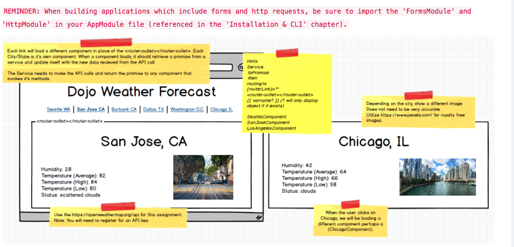

Dojo Weather Forecast
Create an app which presents the user with 6 different views (using the router-outlet) each different url/view should present the user with a Dojo city. Within each of these views, present the user with the current weather information. This assignment will require you to retrieve an API key from https://openweathermap.org/api

Additionally, show an image of each of the cities, you can use https://www.pexels.com/ for royalty free images.

Use the following URL pattern for each city:

Default (root) url - 'http://localhost:4200/' should immediately redirect us to your local Dojo url. 

Seattle, WA - 'http://localhost:4200/seattle'

San Jose, CA - 'http://localhost:4200/sanjose'

Burbank, CA - 'http://localhost:4200/burbank'

Dallas, TX - 'http://localhost:4200/dallas'

Washington D.C. - 'http://localhost:4200/dc'

Chicago, IL - 'http://localhost:4200/chicago'

REMINDER: When building applications which include forms and http requests, be sure to import the 'FormsModule' and 'HttpModule' in your AppModule file (referenced in the 'Installation & CLI' chapter).

# WeatherForcast

This project was generated with [Angular CLI](https://github.com/angular/angular-cli) version 1.2.1.

## Development server

Run `ng serve` for a dev server. Navigate to `http://localhost:4200/`. The app will automatically reload if you change any of the source files.

## Code scaffolding

Run `ng generate component component-name` to generate a new component. You can also use `ng generate directive|pipe|service|class|module`.

## Build

Run `ng build` to build the project. The build artifacts will be stored in the `dist/` directory. Use the `-prod` flag for a production build.

## Running unit tests

Run `ng test` to execute the unit tests via [Karma](https://karma-runner.github.io).

## Running end-to-end tests

Run `ng e2e` to execute the end-to-end tests via [Protractor](http://www.protractortest.org/).
Before running the tests make sure you are serving the app via `ng serve`.

## Further help

To get more help on the Angular CLI use `ng help` or go check out the [Angular CLI README](https://github.com/angular/angular-cli/blob/master/README.md).
# MEAN_AGULAR_DojoForecast
